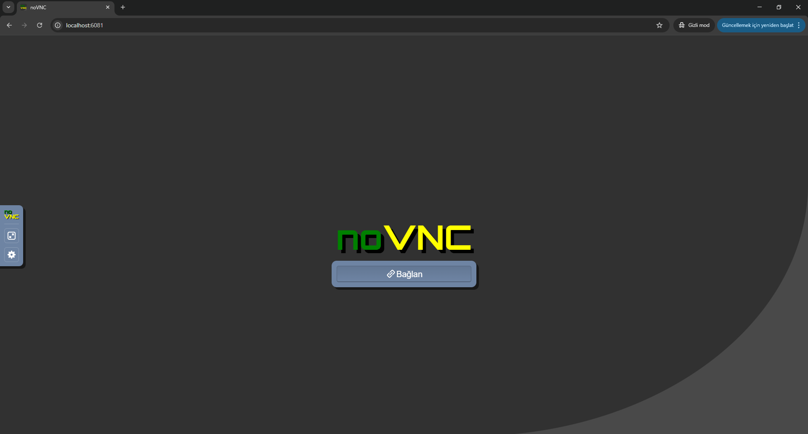
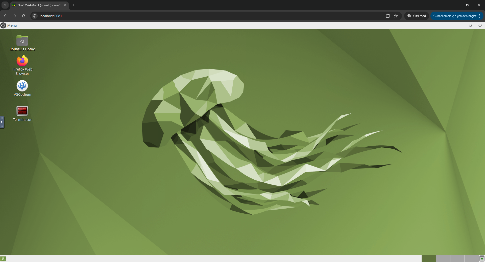
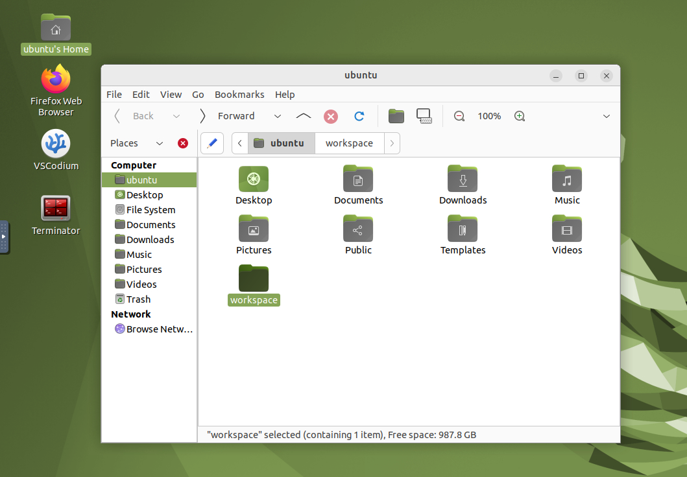
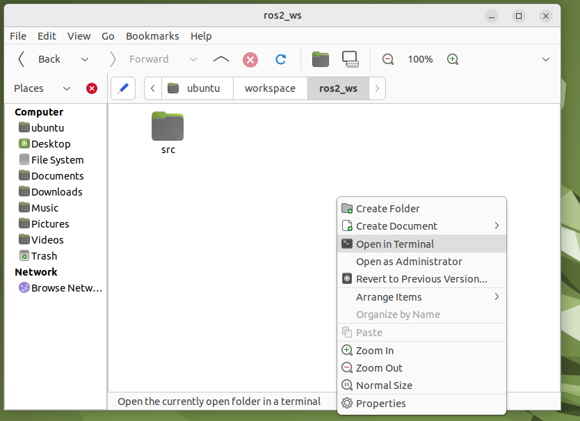
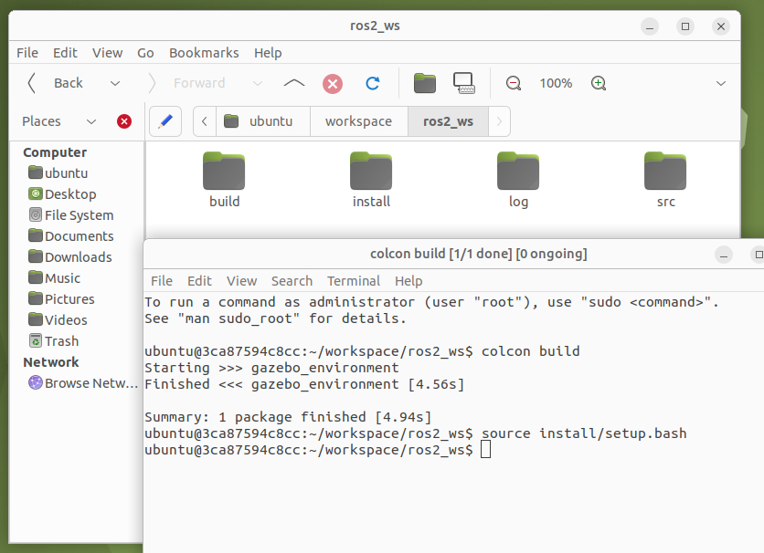
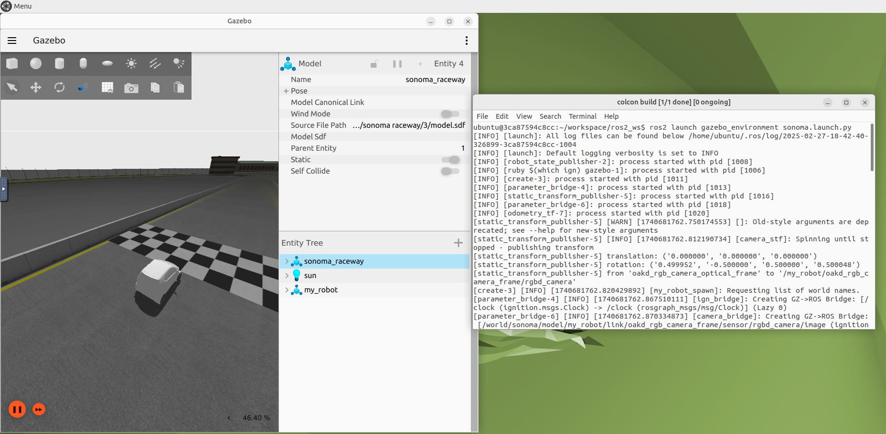

# Docker-Workspaces  
Simulation Environment  

## Clone Repository  
Clone the repository with submodules using this command:  
```bash
git clone https://github.com/ITU-EMAV/Docker-Workspaces.git -b simulation-environment --recursive
```

To update submodules recursively:  
```bash
git submodule update --init --recursive
```  

## Run  
After installing Docker, run the appropriate script for your operating system:  
- Use [```run.bat```](run.bat) for Windows.  
- Use [```run.sh```](run.sh) for Ubuntu or Mac.  

## Open Environment  
1. Run the [```run.sh```](run.sh)/[```run.bat```](run.bat) script.  
2. Open **Google Chrome**.  
3. Type `localhost:6081` in the address bar and click **Connect**.  
      
4. You are now in a virtual environment for developing ROS and Gazebo projects.  
      
5. In **Ubuntu's Home** folder, there is a `workspace` directory containing `ros2_ws` and `gazebo_environment`.  
      
6. Open a terminal inside the `ros2_ws` folder.  
      
7. Run the following commands in the terminal:  
    ```bash
    colcon build
    source install/setup.bash
    ```
      
8. Your environment is now ready.  

## Test the Environment  
In the same terminal, type:  
```bash
ros2 launch gazebo_environment sonoma.launch.py
```
  

The Gazebo environment should now open on your screen.  
